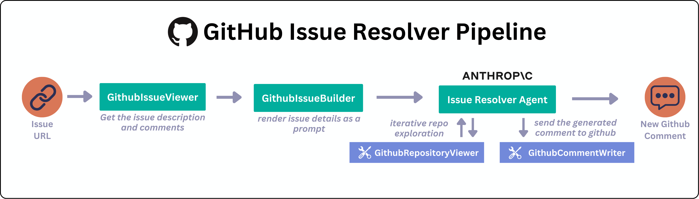

# Github Agent

A [Haystack](https://haystack.deepset.ai/) agent that check that can create instructions to resolve the given Github issue.



Given an issue URL, the agent can:

* Fetch and parse the issue description and comments
* Identify the relevant repository, directories, and files
* Retrieve and process file content
* Determine the next steps for resolution and post them as a comment

Once you have a working agent, you can deploy and serve the agent as a REST API with [Hayhooks](https://github.com/deepset-ai/hayhooks)

## Requirements
* [Anthropic API key](https://www.anthropic.com/)
* [Github Token](https://docs.github.com/en/authentication/keeping-your-account-and-data-secure/managing-your-personal-access-tokens)


### Install Dependencies
```bash
pip install -r requirements.txt
```

### Deploy with Hayhooks

Start the Hayhooks server:
```bash
hayhooks run
```

Deploy the agent:
```bash
hayhooks pipeline deploy-files deployment -n github-agent
```